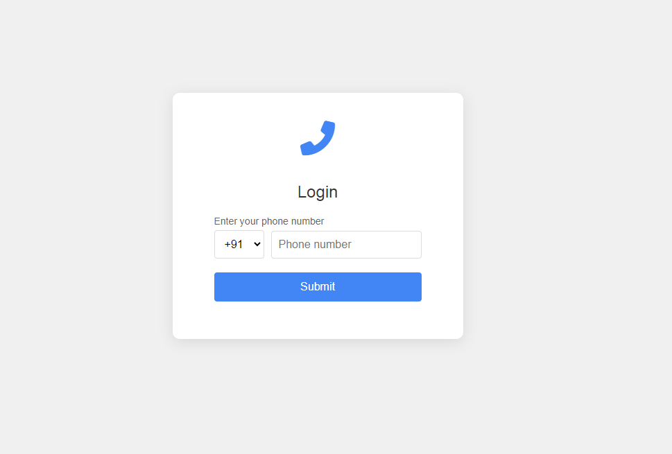
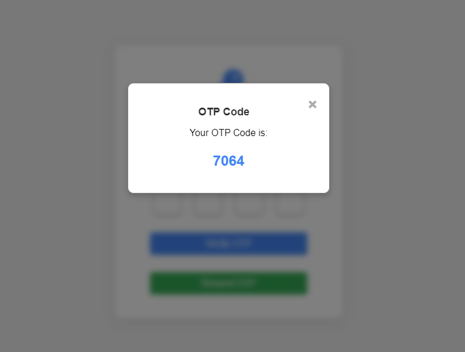
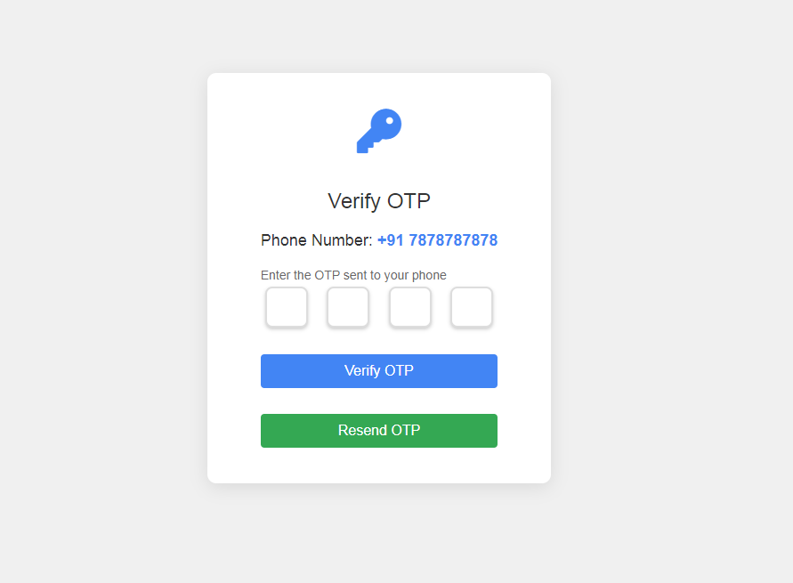

# Responsive OTP Authentication

This project implements a responsive OTP-based phone number authentication system. Users can log in by entering their phone number, receive an OTP, and verify it to access the welcome page. Additionally, there is a feature to resend the OTP.

## Features

### Responsive Design
The application is fully responsive and adapts to various screen sizes, ensuring a consistent user experience on desktops, tablets, and mobile devices.

### Phone Number Input with Country Code Selection
- A dropdown for selecting the country code.
- An input field for the phone number.
- Only valid phone numbers are accepted.

### OTP Input with Automatic Focus Shift
- Four input fields for entering the OTP.
- Automatic focus shift to the next field after entering a digit.
- OTP validation and error handling.

### OTP Generation and Display
- OTP is generated and displayed in a popup for demonstration purposes.
- OTP popup can be closed manually or by clicking outside the popup.

### Resend OTP Feature
- Users can request a new OTP if they have not received or lost the previous one.
- The OTP will be regenerated and displayed in the OTP popup.

### Local Storage Usage
- Temporary storage of phone number and OTP in local storage.
- Data persistence during the session.

## Photos of UI

### MainPage
- 

### Otp PopUp
- 

### Otp PopUp
- 

### Welcome Page
- 

## File Structure

```plaintext
.
├── css
│   ├── otp.css         # Styles specific to OTP page
│   ├── styles.css      # General styles for the project
│   ├── welcome.css     # Styles specific to Welcome page
├── pages
│   ├── otp.html        # OTP verification page
│   ├── welcome.html    # Welcome page after successful OTP verification
├── index.html          # Main login page
├── script.js           # JavaScript logic for the application
└── README.md           # This README file

